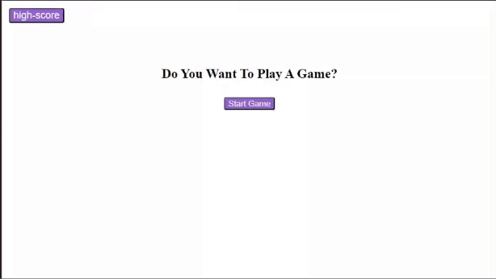

# Timed Code Quiz

## My Task

I was tasked with creating a quiz that tests the users knowledge of java.

In my quiz the question order is randomized as well as the answer order with the exception of a bonus question at the end.

I made my buttons for the answers in the html then changed the text for each question and answer set through JavaScript.

My highscores are added to the page dynamicaly using a loop and local storage.

I added a div to tell you wether the answer selected previously is correct or incorrect. Then using the set timeout function I remove the correct or incorrect text from the page.


## Given Acceptance Criteria

```
GIVEN I am taking a code quiz
WHEN I click the start button
THEN a timer starts and I am presented with a question
WHEN I answer a question
THEN I am presented with another question
WHEN I answer a question incorrectly
THEN time is subtracted from the clock
WHEN all questions are answered or the timer reaches 0
THEN the game is over
WHEN the game is over
THEN I can save my initials and my score
```

## Mock-Up

The following animation demonstrates the given the application functionality:


This animation shows my projects functionality:



This is a link to my quiz so you can try it for yourself: [My quiz](https://enchantedmoth.github.io/Code-Quiz/)
